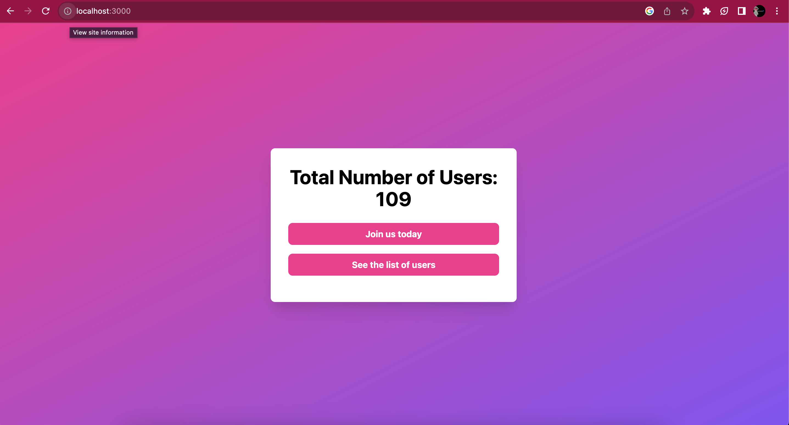
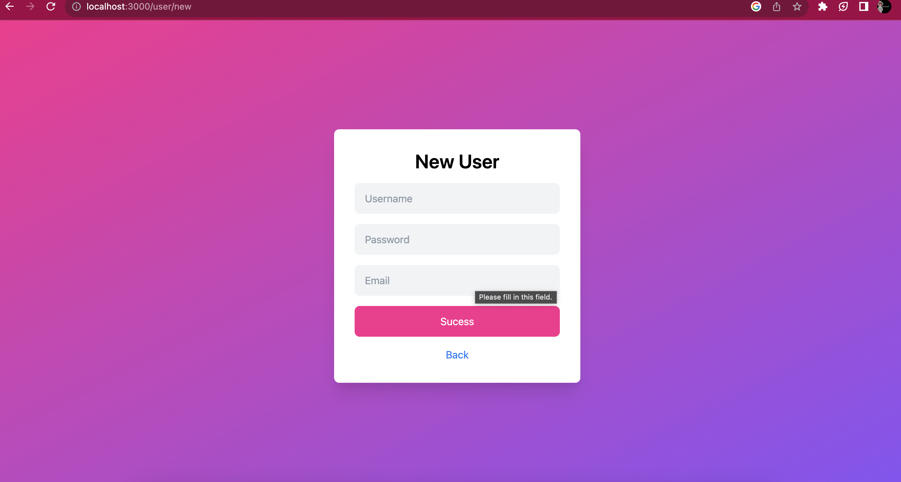
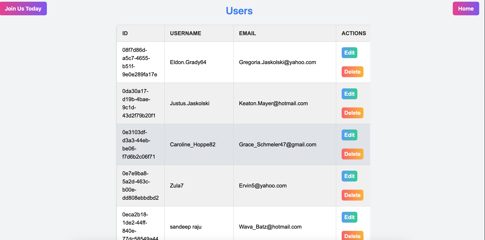

# Simple Web App with Express and MySQL

This is a simple web application built using Express.js with a MySQL database. It provides basic CRUD (Create, Read, Update, Delete) functionalities for managing users.

## Prerequisites

Make sure you have Node.js and MySQL installed on your system.

## Screenshots

## Usage

Access the application through your web browser at `http://localhost:3000`.

### Available Routes

- `GET /`: Shows the number of users in the database.
- `GET /user`: Displays user details.
- `GET /user/:id/edit`: Allows editing a specific user by ID.
- `PATCH /user/:id`: Edits a user's username.
- `GET /user/new`: Renders a form to create a new user.
- `POST /user`: Creates a new user.
- `DELETE /user/:id`: Deletes a user.

## Project Structure

- `app.js`: Main entry point of the application.
- `views/`: Contains EJS templates for rendering views.
- `public/`: Holds static assets like CSS, images, etc.
- `package.json`: Lists project dependencies and scripts.

## Dependencies

- `express`: Web framework for Node.js.
- `ejs`: Template engine for rendering views.
- `method-override`: Middleware for HTTP method override.
- `mysql2`: MySQL client for Node.js.
- `uuid`: Library for generating UUIDs.
- `@faker-js/faker`: Library for generating fake data.

## Contributing

Feel free to contribute by opening issues or submitting pull requests.

